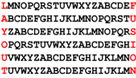
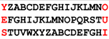
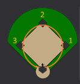
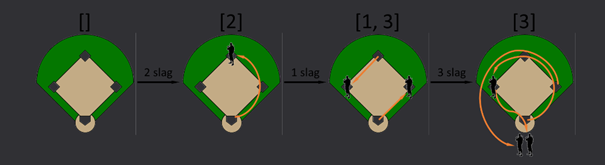

# Python Oefeningen voor Sam

Eerst een korte uitleg over hoe dit (en de meeste andere) Python-projecten gestructureerd zijn. Stel je voor dat ons project een boek is. 

**README.md:**  Eerst het document waar we nu in zitten. Het README-bestand is als de samenvatting op de achterkant van een boek. Het vertelt anderen waar je project over gaat, hoe je het moet opzetten en hoe je het gebruikt. Het is het eerste wat mensen meestal lezen, zodat ze begrijpen wat je project doet en hoe ze erdoorheen kunnen navigeren. In onze README vinden we de beschrijving van de verschillende oefeningen.

**img**: In de map 'img' vindt je afbeeldingen, die gebruikt worden door andere files zoals, in dit geval, de README.md. 

**src:** : In de map 'src' vind je de code van het project. Dit is de ruggengraat van je project waar je al je belangrijkste Python codebestanden (.py) bewaart. Deze bronmap bevat twee submappen: main en test.

**main:** Een wordt altijd main genoemd, en het is het startpunt van je project. Het bevat de code die je mij hebt gevraagd om op te lossen - de oplossingen van de oefeningen.

**test:** De andere map bevat code om de oplossing in de hoofdmap te testen - de code die achter de website zit die je me liet zien toen je je opdrachten indiende. In dit geval staat er niks, maar normaal maak je je test code zelf.

**.idea:**  Dan is er ook nog een andere map genaamd '.idea', die je ook kunt negeren. Dit zijn bestanden die instellingen en configuraties bevatten voor IntelJi IDEA, wat ik gebruikte als IDE (anderen IDEs, zoals Visual Studio, PyCharm, Jupyter Notebook, ILDE, en PyDev, zullen ook dergelijke bestanden maken). De instellingen in de .idea-map helpen de IDE aan te passen aan je voorkeuren. Bijvoorbeeld, het onthoudt welke bestanden je het laatst had geopend, je kleurenschema, code-opmaakinstellingen, en andere persoonlijke voorkeuren.

Het bevat ook instellingen voor Github, wat een cloudservice voor code is. Mensen van over de hele wereld gebruiken GitHub om hun code op te slaan, te delen met anderen en samen aan projecten te werken. Om uit te leggen wat Github doet dit is slechts ter informatie - een analogie: Stel je voor dat je aan een schoolproject werkt met je vrienden. Jullie schrijven allemaal verschillende delen van het project, en je hebt een manier nodig om ieders werk te combineren. Je wilt ook zorgen dat als iemand een fout maakt, je terug kunt naar een eerdere versie. GitHub doet dit voor coderingsprojecten. Ik kan nu gewoon de link van mijn github-repository (= 'mapje') met je delen in plaats van je alle bestanden te sturen. Als je wijzigingen aanbrengt in de code, kan ik ze ook zien op mijn computer.

Als je de code niet allemaal wilt copy-pasten, en deze code wil 'downloaden' en erna eventueel ook met mij samenwerken moest dat nodig zijn, volg je de volgende stappen:
1. *Git downloaden*: Ga naar [de website van Github](https://git-scm.com/), kies "Downloads" en selecteer "Windows". Download de "64-bit Git for Windows Setup" dat op de eerste lijn staat. Voer het gedownloade installatieprogramma uit en volg de instructies. Kies de standaardopties voor een eenvoudige installatie.
2. *Repository klonen*: Open de terminal (Command Prompt programma op Windows) en gebruik cd om naar de map te navigeren waar je de repository wilt klonen (= dit project downloaden). Bijvoorbeeld, als je naar de map PythonCourse in je map Documenten wilt gaan (op verkenner filepath effe goed checken), typ je:
<pre>
cd Documents
cd PythonCourse
</pre>
Gebruik het commando git clone gevolgd door de URL van de repository om dan effectief te klonen naar het gekozen mapje op je computer:
<pre>
git clone https://github.com/lunageens/BasicPython.git
</pre>
Dan kan je dit mapje gewoon opendoen in je IDE (denk dat je PyCharm gebruikt) en dan staat alle code daar al. 


## 1. Spinnen en Muggen

In de natuur groeit het aantal muggen als het warm is. Spinnen kunnen muggen eten en zo helpen om de muggenpopulatie onder controle te houden.

We kunnen de toename van het aantal muggen per week afleiden aan de hand van het totaal aantal muggen in de week ervoor en de temperatuur. Als de temperatuur onder de 18 graden is, groeien muggen niet. Vanaf 40 graden gaan de eieren van muggen dood en kunnen de muggen ook niet groeien. Bij een temperatuur tussen 18 en 39 graden is de groei afhankelijk van de temperatuur volgens de formule *groeifactor = (temperatuur - 18)/21*. Het aantal nieuwe_muggen in een week is *groeifactor * aantal_muggen*. Het aantal nieuwe_muggen wordt naar beneden afgerond op een heel aantal. De kans op opgegeten te worden voor 1 mug *kans = 1 - (0.9 tot de macht aantal_spinnen)*.

Het aantal opgegeten muggen is *kans * aantal_muggen*. Een totaal van minimaal 20 opgegeten muggen resulteert in 1 nieuwe_spin, 40 opgegeten muggen in 2 nieuwe_spinnen enz.

### Opdracht

- Vraag een gebruiker om de temperatuur in graden Celsius als geheel getal in te voeren.
- Het programma stopt als de gebruiker een temperatuur ingeeft lager dan 18 graden met de boodschap "Het is nu te koud
  voor muggen"
- Het programma stopt als de gebruiker een temperatuur ingeeft die 40 graden of hoger is met de boodschap "Het is nu te
  warm voor muggen"
- Start met 100 muggen en 1 spin
- Schrijf een lus die in tijdstappen van 1 week de groei van het aantal muggen berekent gedurende 10 weken
- Bereken in iedere stap van de lus het aantal nieuwe_muggen met de groeifactor en het aantal_muggen van de vorige stap
- Bereken in iedere stap van de lus het aantal opgegeten_muggen met het aantal_muggen en aantal_spinnen van de vorige
  stap
- Bereken in iedere stap het aantal nieuwe_spinnen met het aantal opgegeten_muggen van die stap
- Druk voor iedere week de aantallen muggen en spinnen af.

### Voorbeeld

**Eerste Voorbeeld**

Invoer:
<pre>25</pre>
Uitvoer:
<pre>
week 0 100 1
week 1 124 1
week 2 153 1
week 3 189 1
week 4 234 1
week 5 289 2
week 6 331 4
week 7 328 9
week 8 237 19
week 9 112 29
week 10 43 34
</pre>


**Tweede Voorbeeld**

Invoer:
<pre>0</pre>
Uitvoer:
<pre>Het is nu te koud voor muggen.</pre>

## 2. Gene Finding

De eerste stap bij het vinden van eitwit-coderende genen in DNA, is het vinden van Open Reading Frames, ofwel openleesramen. Een Reading Frame of leesraam is een startpunt vanaf waar je het DNA in codons, 3 letters, opdeelt. Je kan beginnen van de 1e, 2e of 3e letter in de voorwaartse DNA-streng of de 1e, 2e of 3e letter op de complementaire DNA-streng. Er zijn dus 6 leesramen in totaal. Een Open Reading Frame is een startcodon gevolgd door een aantal codons en dan een stopcodon in hetzelfde leesraam. Kijken we in een stuk DNA, dan vinden we meestal meerdere overlappende ORFs in de verschillende Reading Frames, het langste ORF is meestal een valide eitwit-coderend gen, terwijl de kortere overlappende ORFs niet voor eitwitten coderen. Er zijn nog bijkomende signalen nodig om te valideren dat de langste ORF inderdaad voor een eitwit codeert, zoals een RNA polymerase bindingsplaats en een ribosoombindingsplaats. In deze opdracht kijken we alleen naar langste ORFs.

### Opdracht

Schrijf een functie lees_dna die een bestand inleest waar een DNA sequentie in zit. De DNA streng wordt in een string-variabele gezet, zonder alle witruimtes en nieuwe regels die eventueel in het bestand staan. De input voor de functie is de bestandsnaam, de output de string variabele. Je kan ervanuit gaan dat het bestand zich in de huidige directory bevindt.

Schrijf een functie reverse_complement die een string variabele als input heeft en de complementaire streng in de omgekeerde volgorde als output geeft.

Schrijf een functie vind_orfs die een lijst genereert van alle Open Reading Frames in een stuk DNA de twee richtingen. Ieder element uit de lijst is een string variabele met de DNA sequentie. Binnen deze functie roep je de functie reverse_complement aan. We vinden alleen de ORFs die beginnen met start-codon ATG en een van de drie stop-codons TAG, TAA of TGA.

Schrijf een functie langste_orf die een lijst als input heeft, zoals gegenereerd met vind_orfs en de langst of als output heeft.

Schrijf een functie transleer_orf die een orf omzet naar aminozuur-sequentie, je kan daarvoor de tabel codon_tabel.txt gebruiken. Je kan ervanuit gaan dat het bestand codon_tabel.txt zich in de huidige directory bevindt.

## 3. Woordevoluties

Als je de letters van het woord FREUD op een uniforme manier doorheen het alfabet laat evolueren dan bekom je het woord COBRA. Daarbij laten we na de letter Z terug de letter A volgen.


Op dezelfde manier verkrijg je FUSION uit LAYOUT.



We kunnen dezelfde techniek zelfs toepassen om woorden te vertalen.



Dit kan toch echt wel geen toeval zijn?

### Invoer

Op de eerste regel staat een woord dat enkel bestaat uit hoofdletters. Op de tweede regel staat een hoofdletter.

### Uitvoer

De evolutie van het gegeven woord naar het woord dat begint met de gegeven letter, als we de letters op een uniforme manier doorheen het alfabet laten evolueren. De letters van het gegeven woord worden aan de linkerkant onder elkaar uitgeschreven in hoofdletters. De letters van het woord dat begint met de gegeven letter en dat men bekomt na evolutie, worden aan de rechterkant onder elkaar uitgeschreven in kleine letters, waarbij na de laatste letter van het alfabet terug de eerste letter volgt.

### Voorbeeld

**Eerste Voorbeeld:**

Invoer:
<pre>
FREUD
C
</pre>

Uitvoer:
<pre>
FghijklmnopqrstuvwxyzAbC
RstuvwxyzabcdefghiJklmnO
EfgHiJklmnopqrstuvwxyzAaB
UvwxyzabcdefghiJklmnopqR
DefghijKlmnopqrstuvwxyzZA
</pre>


**Tweede Voorbeeld:**

Invoer:
<pre>
COBRA
F
</pre>

Uitvoer:
<pre>
CdeF
OpqR
BcdE
RstU
AbcD
</pre>

## 4. Jupiter-C

De Jupiter-C was een Amerikaanse onderzoeksraket die ontwikkeld werd als opvolger van de Jupiter-A. Ze werd in 1965 en 1957 gebruikt voor drie suboritale ruimtevluchten om te testen of de neuskegel die later gemonteerd zou worden op de meer geavanceerde en mobiele PGM-19 Jupiter raket het zou houden bij terugkeer in de atmosfeer. Als lid van de famile van Redstone-raketten werd ook de Jupiter onworpen door de Army Ballistic Missilee Agency (ABMA), onder leiding van Wernher von Braun.

De Jupiter-C maakte deel uit van het IRBM-project en het aartal gefabriceerde raketten werd beschouwd als en streng bewaard militair geheim. Daarom werden de serienummers niet zomaar op de zijkant van de raketten geschilderd, maar werden ze gecodeerd met een eenvoudige transformatiecodering die het personeel makkelijk kon onthouden. Het codewoord voor de transformatie werd ontleend aan de locatie van de miltair basis waar de raket werd ontworpen en getest: Huntsvie, Alabama.

H	U	N	T	S	V	I	L	E	X

1	2	3	4	5	6	7	8	9	0

Door in het woord Huntsville de dubbele letters te schrappen en achteraan een X toe te voegen, verkreeg men een codewoord van tien letters: HMTSVILEX. Daarin stond de letter H voor het cijfer 1, de letter U voor het cijfer 2, … de eter voor E het cijfer 9 en de letter X voor het cijfer 0. Op die manier had men bijvoorbeeld het gecodeerde serienummer UE geverfd op de zijkant van de aangepaste versie van de Jupiter-C die gebruikt werd om de Explorer 1 te lanceren, wat aangaf da die raket serienummer 29 had (U-->2, E-->9). De volgende versie van de Jupiter-C raket werd dan beschilderd met NX, de gecodeerde versie van het serienummer 30 (N-->3, X-->0).

### Opgave

Een **serienummer** is een natuurlijk getal (int) en een **codewoord**  die enkel bestaat uit letters (zowel hoofdletters als kleine letters zijn toegelaten). 

Beschouw nu een transformatiecodering voor serienummers die werkt met een gegeven codewoord. In eerste instantie wordt het codewoord gereduceerd door enkel het eerste voorkomen van elke letter over te houden, waarbij geen onderscheid gemaakt wordt tussen hoofdletters en kleine letters. Op die manier wordt het codewoord TROCHINOPHOBIA bijvoorbeeld gereduceerd tot TRICHNOPBA. Dit **gereduceerde codewoord** moet uit tien letters bestaan, waarvan de eerste letter staat voor het cijfer 1, de tweede voor het cijfer 2, ... de voorlaatste voor cijfer 9 en de laatste voor het cijfer 0. Gevraagd wordt: 
- Schrijf een functie reduceer waaraan een codewoord (str) moet doorgegeven worden. De functie moet in hoofdieters het gereduceerde codewoord (str) teruggeven.
- Schrijf een functie codeer waaraan een serienummer (int) en en codewoord (str) moeten doorgegeven worden. De functie moet in hoofdeters de gecodeerd versie (str) van het gegeven serienummer teruggeven die bekomen wordt door toepassing van de ransformatiecodering voor serienummers met het gegeven codewoord.
- Schrijf een functie decodeer waaraan twee argumenten moeten doorgegeven worden: i) de gecodeerde versie van een serienummer (str) die bekomen werd door toepassing van de transtomatiecodering voor serienummers met een codewoord en ii) het codewoord dat voor de transformatie gebruikt werd. De functie moet het orginele serienummer (int) teruggeven.
- Schrijf een functie volgende waaraan wee argumenten moeten doorgegeven worden: i) de gecodeerde versie van een serienummer (str) die bekomen werd door toepassing van de transfomatiecodering voor serienummers met een codewoord en ii) het codewoord dat voor de transformatie gebruikt werd. De functie moet in hoofdletters de gecodeerde versie van het volgende serienummer teruggeven, waarbij het gegeven codewoord ook voor het volgende seenummer gebruikt wordt. Als bijvoorbeed de gecodeerde versie van het serienummer 29 wordt doorgegeven dan moet de functie de gecodeerde versie van het volgende serienummer 29 +1 = 30 teruggeven. Als de gecodeerde versie van het serienummer 99 word doorgegeven dan moet de functie de gecodeerde versie van het volgende serienummer 99+1=100 teruggeven. 

De functies mogen geen onderscheid maken tussen hoofdletters en kleine letters in de codewoorden en de gecodeerde serienummers die eraan doorgegeven worden.

Als aan de functies codeer, decodeer of volgende een codewoord wordt doorgegeven waarvan de gereduceerde versie niet uit 10 letters bestaat, dan moet een AssertionError opgeworpen worden met de boodschap ongeldig codewoord.

### Voorbeeld

```python
>>> reduceer('HUNTSVILLEX')
'HUNTSVILEX'
>>> reduceer('TRICHINOPHOBIA')
'TRICHNOPBA'

>>> codeer(29, 'HUNTSVILLEX')
'UE'
>>> codeer(63, 'TRICHINOPHOBIA')
'NI'

>>> decodeer('UE', 'HUNTSVILLEX')
29
>>> decodeer('NI', 'TRICHINOPHOBIA')
63

>>> volgende('UE', 'HUNTSVILLEX')
'NX'
>>> volgende('NI', 'TRICHINOPHOBIA')
'NC'
```

## 5. Honkbal

Honkbal is een balsport waarin twee teams van negen spelers het tegen elkaar opnemen. De sport is vooral populair in de Verenigde Staten, Canada, Mexico, de Caraïben en grote delen van Azië. In Europa is de sport minder populair. Een wedstrijd bestaat uit negen **innings**. Elke inning bestaat uit twee speelhelften. In de ene speelhelft verdedigt het thuisspelende team in het veld en is het bezoekende team in de aanval. In de andere speelhelft zijn de rollen omgedraaid. Alleen het aanvallende team kan punten scoren.



Het speelveld bestaat uit vier **honken** in de vorm van een ruit, aangegeven door de witte vlakken in bovenstaande figuur. Op de thuisplaats (witte vlak onderaan) is telkens een volgende speler van het aanvallende team aan slag. Deze speler wordt de **slagman** genoemd. Een **werper** van het verdedigende team gooit een bal naar de thuisplaats waar de slagman van het aanvallende team hem moet proberen te raken. Als de slagman de bal kan raken, dan moet hij in tegenwijzerzin één voor één de honken proberen te bereiken vóór het verdedigende team de bal bij het honk kan brengen. Als er bij de slag reeds honken bezet waren door andere aanvallende spelers, dan mogen deze ook proberen om de volgende honken te bereiken (in tegenwijzerzin). Wanneer een aanvallende speler alle vier de honken is gepasseerd, dan scoort hij één punt. Wanneer een slagman alle honken in zijn eigen slagbeurt kan passeren, dan heet dat een **homerun**.

### Opdracht

Bij het spelletje honkbal kunnen enkel het eerste, het tweede en het derde honk bezet worden door aanvallende spelers. Daarom stellen we de **bezette honken** voor als een reeks (list of tuple) die enkel de getallen 1 (eerste honk), 2 (tweede honk) en 3 (derde honk) kan bevatten. De getallen worden altijd in stijgende volgorde opgelijst.

We houden enkel rekening met **n-slagen**, waarbij \( n \in \mathbb{N} \) en \( 0 \leq n \leq 4 \). Bij een 0-slag kan de slagman de bal niet raken, en mag hij het veld niet betreden (waardoor hij ook geen punten kan scoren). Bij een n-slag ( \( 0 < n \leq 4 \) ) lopen alle aanvallende spelers op het veld (de slagman en alle spelers die reeds honken bezet hielden) n honken vooruit in tegenwijzerzin. Alle spelers die hierbij de thuishplaats bereiken, scoren een punt en stappen uit het veld. Een homerun is dus gelijk aan een 4-slag.



Bij aanvang van een speelhelft zijn er nog geen honken bezet, wat kan worden voorgesteld door een lege reeks (linkse situatie in bovenstaande figuur). Als de eerste slagman een 2-slag opentekenen, dan loopt hij over het eerste honk naar het tweede honk. Als de tweede slagman daarna een 1-slag doet, dan loopt hij naar het eerste honk en loopt de eerste slagman door naar het derde honk. Als de derde slagman daarna een 3-slag doet, dan loopt hij naar het derde honk en scoren de twee aanvallende spelers die reeds het eerste en derde honk bezet hielden elk één punt omdat ze de thuishplaats bereiken.

### Gevraagd wordt:

- Schrijf een functie `slag` waaraan een getal \( n \) \( (n \in \mathbb{N}, 0 \leq n \leq 4) \) moet doorgegeven worden. De functie heeft ook nog een tweede optionele parameter `bezet` waaraan een reeks (list of tuple) kan doorgegeven worden, die aangeeft welke honken bezet waren vóór de slagman op het veld kwam. Als er geen expliciete waarde wordt doorgegeven aan de parameter `bezet`, dan zijn er nog geen honken bezet. De functie moet een tuple teruggeven met twee elementen die de spelsituatie beschrijven nadat de slagman een n-slag gedaan heeft: i) de punten (int) die door alle aanvallende spelers behaald werden bij de slag en ii) de honken die bezet zijn (list) na de slag.
- Schrijf een functie `inning` waaraan een reeks (list of tuple) van getallen (int) uit het interval [0, 4] moet doorgegeven worden. Deze getallen stellen de opeenvolgende n-slagen voor die binnen één speelhelft gedaan worden. De functie moet een tuple met twee waarden teruggeven: i) de punten (int) die het aanvallende team behaald heeft tijdens de speelhelft en ii) de honken die bezet zijn (list) op het einde van de speelhelft.

#### Voorbeeld

```python
>>> slag(2)
(0, [2])
>>> slag(0, [1, 3])
(0, [1, 3])
>>> slag(1, [1, 3])
(1, [1, 2])
>>> slag(2, bezet=[1, 3])
(1, [2, 3])
>>> slag(3, bezet=[1, 3])
(2, [3])
>>> slag(4, bezet=[1, 3])
(3, [])

>>> inning([0, 1, 2, 3, 4])
(4, [])
>>> inning([4, 3, 2, 1, 0])
(2, [1, 3])
>>> inning([1, 1, 2, 1, 0, 0, 1, 3, 0])
(5, [3])
```
